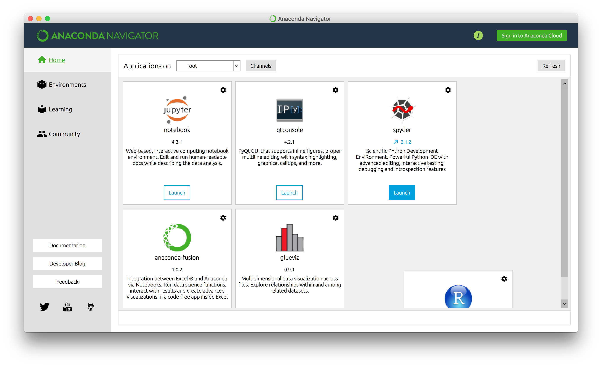
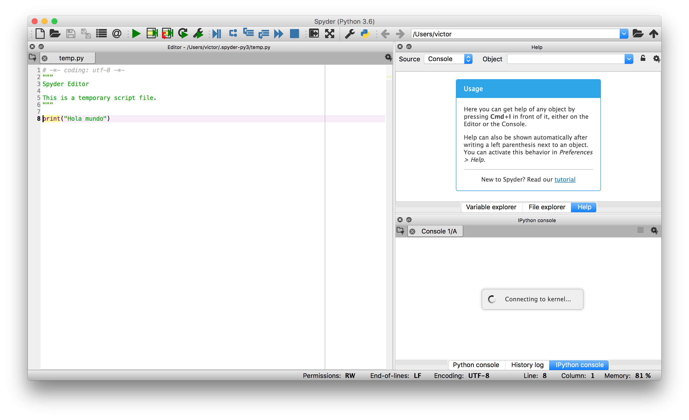

# Introducción a Python

Ejemplos de introducción a Python

Para poder ejecutarlos es necesario Python 3 o superior. Recomendamos instalar [Anaconda](https://www.continuum.io).

- Una vez instalado pulsaremos en el botón "launch" de spyder.

Tras esto podremos trabajar con el IDE Spyder:

## Ejercicio

Crear una función que dada una ruta de nuestro sistema, muestre un listado de todas las imágenes.

* ver modulo [OS](https://docs.python.org/2/library/os.html)
* ver modulo [FnMatch](https://docs.python.org/2/library/fnmatch.html)
