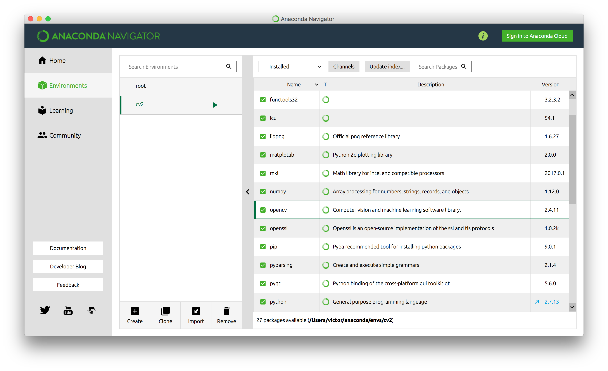

# Visión Artificial

Repositorio con los ejemplos sobre vision artificial. Aquí se detallan las instrucciones para instalar opencv usando [Anaconda](https://www.continuum.io/).

Para instalar Opencv, tenemos que crear un nuevo "enviorement" que llamaremos cv2 y utilizaremos Python 2.7 (Hay versiones ya para Python 3 pero para este ejemplo usaremos la version 2). En este Enviorement instalaremos los siguientes paquetes:

* numpy
* matplotlib
* opencv



Tras instalar estos paquetes y ejecutar una terminal, ejecutaremos el siguiente código:

```python
import cv2

cv2.__version__

```